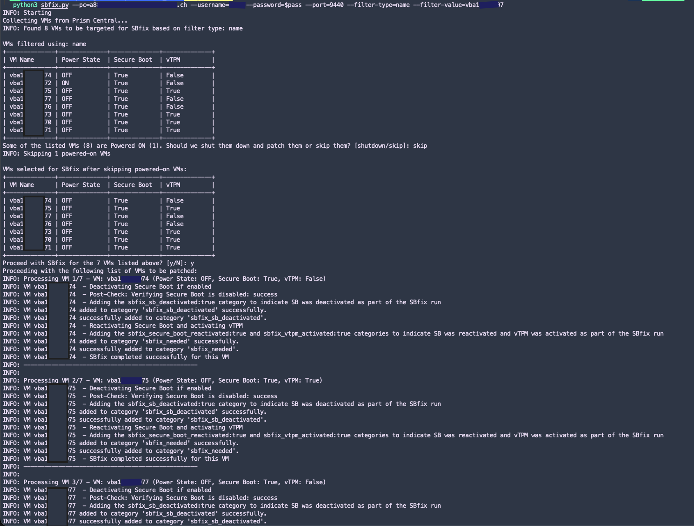
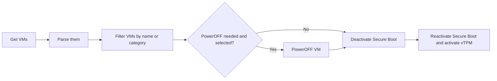

# SBfix for Nutanix AHV VMs

`sbfix.py` is an interactive helper for refreshing Secure Boot state and vTPM configuration on Nutanix AHV VMs from Prism Central. It is intended for environments affected by recent Microsoft Secure Boot certificate issues, where VMs may need their Secure Boot state refreshed so the updated certificate chain is applied.

The remediation itself is simple for one VM: deactivate Secure Boot, then activate Secure Boot again, and ensure vTPM is enabled. Doing that safely across hundreds or thousands of VMs requires reliable discovery, filtering, confirmation, shutdown handling, logging, and audit categories. That is why this script exists.



## Features

- Connects to Prism Central using the Nutanix VMM and Prism Python SDKs.
- Lists VMs in a readable table with VM name, power state, Secure Boot state, and vTPM state.
- Supports targeting VMs by category or by name substring.
- Skips VMs already marked as processed with `sbfix_needed:false`.
- Detects powered-on VMs and asks whether to shut them down and patch them or skip them.
- Suppresses noisy SDK request/response logs and urllib3 TLS warnings in the console.
- Writes detailed run logs under `log/`.
- Adds/removes SBfix categories so the workflow can be audited and resumed safely.

## Requirements

- Python 3.10 or newer.
- Network access to Prism Central.
- A Prism Central account with permission to list VMs, read categories, update VM categories, power off VMs, and update VM boot/vTPM configuration.
- The required SBfix categories listed below must exist in Prism Central before running the script.

Install dependencies:

```bash
python3 -m pip install -r requirements.txt
```

## Required Categories

Create these Prism Central categories before using category-based targeting or before running the full patch workflow.

| Category key | Required value | Purpose |
| --- | --- | --- |
| `sbfix_needed` | `true` | Marks a VM as eligible for SBfix when running with `--filter-type=category`. |
| `sbfix_needed` | `false` | Marks a VM as already processed. The script skips VMs with this category. |
| `sbfix_vm_shutdown` | `true` | Records that the script shut down the VM as part of the SBfix run. |
| `sbfix_sb_deactivated` | `true` | Records that Secure Boot was deactivated during the remediation flow. |
| `sbfix_secure_boot_reactivated` | `true` | Records that Secure Boot was reactivated after remediation. |
| `sbfix_vtpm_activated` | `true` | Records that vTPM was activated after remediation. |

## How To Use

Run the script from the repository root:

```bash
python3 sbfix.py \
  --pc=a88a-npc-vdi.svc.kb-bedag.ch \
  --username=<username> \
  --port=9440 \
  --filter-type=category
```

If `--password` is omitted, the script prompts for it interactively. This is safer than storing the password in shell history or VS Code launch configuration.

To target VMs by name substring instead of category:

```bash
python3 sbfix.py \
  --pc=a88a-npc-vdi.svc.kb-bedag.ch \
  --username=<username> \
  --port=9440 \
  --filter-type=name \
  --filter-value=<vm-name-fragment>
```

Common options:

| Option | Description |
| --- | --- |
| `--pc` | Prism Central FQDN or IP address. Required. |
| `--username` | Prism Central username. Required. |
| `--password` | Prism Central password. If omitted, an interactive prompt is used. |
| `--port` | Prism Central API port. Defaults to `9440`. |
| `--verify-ssl` | Verify Prism Central TLS certificates. By default verification is disabled. |
| `--page-size` | Number of VMs/categories to request per API page. Defaults to `100`. |
| `--filter-type` | Targeting mode: `category` or `name`. |
| `--filter-value` | Name substring used when `--filter-type=name`. |

## Workflow



The script implements that workflow with guardrails:

1. It connects to Prism Central and retrieves VMs and categories.
2. It filters candidate VMs by `--filter-type`, using either category membership or a VM name substring.
3. VMs already tagged with `sbfix_needed:false` are skipped.
4. It prints the target table with power, Secure Boot, and vTPM state.
5. If any selected VMs are powered on, it asks whether to shut them down and patch them or skip them.
6. If powered-on VMs are skipped, it prints a new table with only the remaining VMs and asks for confirmation again.
7. It deactivates Secure Boot, reactivates Secure Boot, enables vTPM, and updates SBfix categories to reflect progress.

## Notes

- The script performs changes to VMs, including shutdown and boot/vTPM configuration changes. Review the VM table carefully before confirming.
- Console output is intentionally kept concise. Detailed logs are written to `log/sbfix_<timestamp>.log`.
- Use `--verify-ssl` in environments where Prism Central has a trusted TLS certificate.
